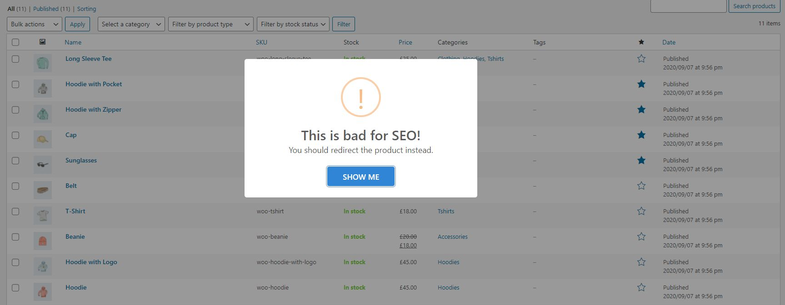
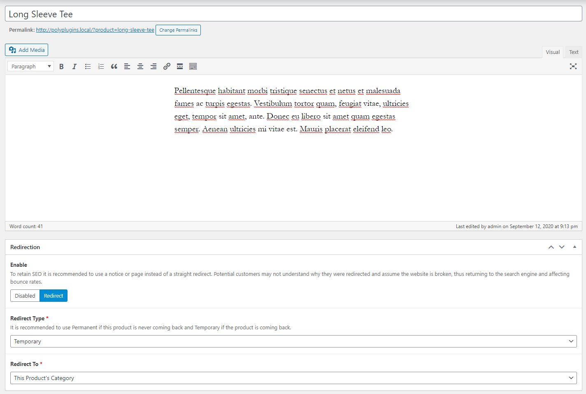
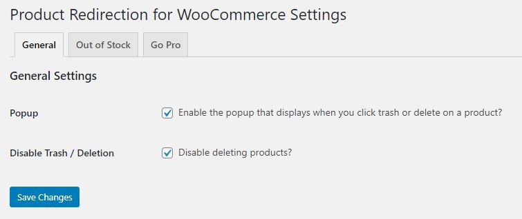

## About

Deleting products without any redirects can result in a negative impact on your Search Engine Optimization or SEO. To prevent product deletion a notice is displayed on clicking trash to inform that they should be redirecting.

[Demo Video](https://youtu.be/WCCaI83Bw5c)

## Free Version

* Notice in product manager to not delete products
* Option in product to redirect to parent category or a custom url
* Setting: Remove product deletion notice
* Setting: Disable trash/delete on product manager

## [Pro Version](https://www.polyplugins.com/product/product-redirection-for-woocommerce/ "Poly Plugins"):

* Notices on product page that the product is no longer in stock
* Automatic out of stock product handling
* Landing pages
* Product recommendations

## GDPR

We are not lawyers and always recommend doing your own compliance research into third-party plugins, libraries, etc., as we've seen other plugins not be in compliance with these regulations.

This plugin uses the Bootstrap, BootStrap Icons, and SweetAlert2 third-party libraries. These libraries are loaded locally to be compliant with data protection regulations.

This plugin collects and stores certain data on your server to ensure proper functionality. This includes:

* Storing plugin settings
* Remembering which notices have been dismissed

## Installation

1. Backup WordPress
2. Upload the plugin files to the `/wp-content/plugins/` directory, or install the plugin through the WordPress plugins screen directly.
3. Activate the plugin through the 'Plugins' screen in WordPress
4. Configure the plugin

## Frequently Asked Questions

### Why should I use this?

Deleting products is bad for Search Engine Optimization (SEO) and setting redirects through apache can lead to a huge htaccess.

### Why are fields on products not loading?

If you have ACF installed already, you may need to sync the fields, as they are stored via json to reduce db calls. We built this around ACF to reduce development times and to prevent adding unnecessary code if you already have it installed.

### Why does this use ACF?

Mainly to reduce the amount of time in development, but also to save resources. If you already have Advanced Custom Fields installed, then you don't have to worry about additional code executing on product admin pages.

## Screenshots

## Changelog

### 1.1.9
* Bugfix: Duplicate translation

### 1.1.8
* Bugfix: Unexpected output on activation due to admin notices displaying after activation
* Enhancement: Made use of namespacing to prevent class clashes
* Optimized: Various code chunks

### 1.1.6
* Optimization: Refactored code in preparation for Advanced Custom Fields standalone dependancy
* Added: Additional Error Handling
* Fix: Deprecations

### 1.1.5
* Fix: Versioning

### 1.1.4
* Added: Notice to add Advanced Custom Fields as we will be removing it as a dependancy from our plugin
* Enhancement: Optimized code

### 1.1.3
* Updated: Dependencies
* Fix: Deprecations. We plan to rewrite the entire plugin in a future release to remove ACF dependency and further optimize code.

### 1.1.2
* Bugfix: ACF Header Error

### 1.1.1
* Improved: Trash Deletion Prevention
* Bugfix: ACF fields showing on posts
* Bugfix: Trash Can Disable message showing on trashed products
* Added: Roadmap CTA on plugins page
* Adjustment: Disable trash is now set to default enabled

### 1.0.0
* Initial Release